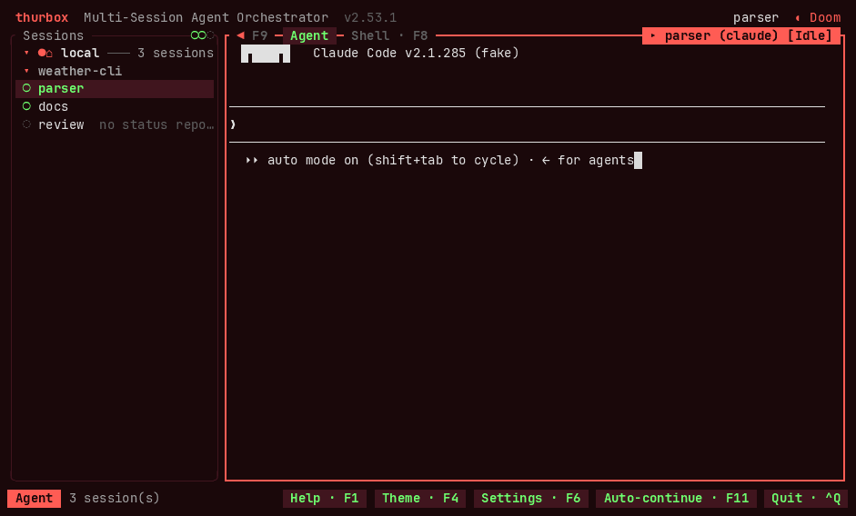

# thurbox-auto-continue

Auto-continue for Claude sessions in [Thurbox](https://github.com/Thurbeen/thurbox).

When a Claude Code session hits its usage limit, this extension waits until the
quota window resets and then types `continue` into that session, once. It
works with the Thurbox TUI closed, and no LLM is involved: one small
deterministic binary makes every decision.

It is **off by default**, globally and for every session.



The demo shows the real TUI with a fake Claude in a throwaway sandbox.
[`demo/record.sh`](demo/record.sh) records it again.

## Install

Needs `thurbox-cli` (Thurbox 2.36.2 or newer), Claude Code, and `cargo` (or a
prebuilt binary). Run this on every machine that runs Claude sessions:

```sh
git clone https://github.com/Thurbeen/thurbox-auto-continue
cd thurbox-auto-continue
./install.sh                    # or: ./install.sh --binary <path>
```

`~/.local/bin` must be on `PATH`, because Claude's hook calls the binary from
there.

Then add the two TUI panes: the settings and monitor pane, and the badge on
session rows.

```sh
thurbox-cli plugin install git+https://github.com/Thurbeen/thurbox-auto-continue --as ui/plugins/85_auto_continue.lua
thurbox-cli plugin install git+https://github.com/Thurbeen/thurbox-auto-continue --as ui/plugins/86_auto_continue_badge.lua
thurbox-cli plugin check        # loaded: … auto-continue, auto-continue-badge
```

**Grant each pane `run` once.** Open Settings (`Ctrl+,` or `F6`), go to the
Interface tab (`]`), select `thurbox-auto-continue/ui/plugins/85_auto_continue.lua`
and press `t`. Do the same for `86_auto_continue_badge.lua`. Until you do, the
pane runs nothing and the badge stays hidden.

## Turn it on

In the TUI, press **F11** to open the pane. Select the *Every Claude session*
row or a single session, then press `e` to switch it on or off, `m` to edit the
message, and `d` to edit the delay.

From a shell:

```sh
thurbox-auto-continue config set enabled on      # every Claude session
thurbox-auto-continue enable <session>           # one session
thurbox-auto-continue config set message 'resume the task' --session <session>
thurbox-auto-continue config set delay_secs 60 --session <session>
thurbox-auto-continue status                     # what is on, and each session's last episode
```

A setting on the session beats the global one, whether it turns the session on
or off. [docs/USAGE.md](docs/USAGE.md) has the full precedence rules, every
setting, the monitor, and troubleshooting.

## Good to know

- **Linux and macOS.** Native Windows is not supported yet.
- **Shared SSH or WSL hosts:** install on each host too. Each host sends for its
  own sessions.
- **Claude's own countdown wins.** If Claude has armed its own
  `Continuing automatically at …` countdown, or has already resumed, nothing is
  sent.
- **Tested against a fake Claude only.** Its screens and transcripts were
  recorded from Claude Code 2.1.285, but no send has yet been verified at a
  real account's quota reset.

## Stop or remove it

```sh
thurbox-cli extension deactivate auto-continue   # kill switch: every pending send skips
thurbox-cli plugin remove thurbox-auto-continue/ui/plugins/85_auto_continue.lua
thurbox-cli plugin remove thurbox-auto-continue/ui/plugins/86_auto_continue_badge.lua
./install.sh --uninstall                         # settings, episodes, pending sends, the hook
```

Contributing: [AGENTS.md](AGENTS.md). Scripts and interfaces:
[docs/CLI-CONTRACT.md](docs/CLI-CONTRACT.md).
